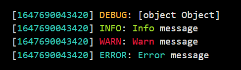
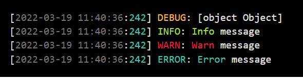
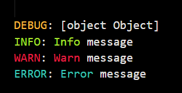

# `@pyle_of_mail/logger`

## Description

Minimal and basic logger written in NodeJS.

## Roadmap

- [x] Logging to the console with log levels defined in env vars
- [x] Color coded messages based on severity
- [x] Option to obfuscate sensitive data when logging
- [x] Option to prefix all log messages by a timestamp
- [x] Logging to a file
- [ ] Logging to an external log server

## Configuring the Logger

### Setting the log level

The log level and is set as an environment variable called `LOG_LEVEL`.

```bash
# .env
LOG_LEVEL = warn
```

There are 4 main types of log messages in this class:

| Log Level |   Method   |                                       Description                                        |                  Printed                   |
| :-------: | :--------: | :--------------------------------------------------------------------------------------: | :----------------------------------------: |
|   error   | logError() |                Used to log problems that require code execution to stop.                 |                   Always                   |
|   warn    | logWarn()  |             Used to log problems that do not require code execution to stop.             | `LOG_LEVEL` in `["warn", "debug", "info"]` |
|   info    | logInfo()  | Used to print generic informational messages. Informs the user on the actions performed. |     `LOG_LEVEL` in `["debug", "info"]`     |
|   debug   | logVars()  |  Used to print variables to the console. Mainly intended for development and debugging.  |         `LOG_LEVEL` in `["info"]`          |

### Logging to the console

The logger class will print all your messages to the console by default.

### Logging to a file

The logger will automatically log everything to a text file as well as to the console, as long as the `LOG_FILE` environment variable is defined.

```bash
# .env
LOG_FILE = /var/log/pyle-of-mail.log
```

### Logging to a syslog server

### Adding a timestamp before each log message

By defining the `TIMESTAMP` environment variable, the logger will automatically log the messages in the `[{timestamp}] {message}` fomrmat.

The `TIMESTAMP` variable has 3 options:

- `TIMESTAMP = millis`



- `TIMESTAMP = date`



- Undefined or set to any other value



Not yet supported, planned for release `1.3.0`.

## Quickstart Guide

### Installing the package

```bash
npm install @pyle_of_mail/logger
```

#### Importing the package

```node
import { Logger } from "@pyle_of_mail/logger";
```

#### Logging error messages

> Error messages will always be printed to the console, regardless of the `LOG_LEVEL` defined in `.env`.

```javascript
Logger.logError(
  "This is an error message. Not only is this printed in red, but it throws an error and stops code execution."
);
```

#### Logging warning messages

> Warning messages will only be printed if the `LOG_LEVEL` is set to `warn`, `info` or `debug`.

```javascript
Logger.logWarn(
  "This is a warning message, and it should be printed in yellow. This probably means something went wrong, but not wrong enough as to quit execution."
);
```

#### Logging info messages

> Info messages will only be printed if the `LOG_LEVEL` is set to `info` or `debug`.

```javascript
Logger.logInfo("This is an info message, and it should be printed in green.");
```

#### Printing variables to the screen

> Variables will only be printed if the `LOG_LEVEL` is set to `debug`.

```javascript
// execute some code
const response = some_function(some_param);

// log the output
Logger.logVar(response);
```

Say you want to obfuscate a variable when printing it to the console. It may be an access token or something. Say you want only the first `n` letters in clear and then you want it obfuscated. The `logger` package includes an `obfuscate()` method you can use:

```javascript
const TOKEN = "my-super-secret-token";

Logger.logVar(obfuscate(TOKEN, 5));
```

The above example will leave the first 5 characters in clear and then obfuscate the rest, producing:

```bash
my-su**************
```

## License

This code is licensed under the [MIT License](./LICENSE).
