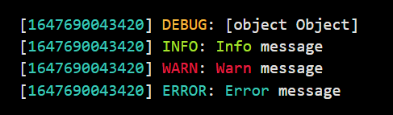
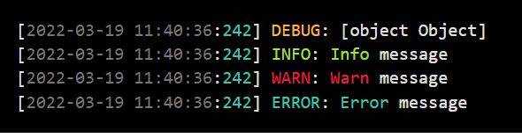
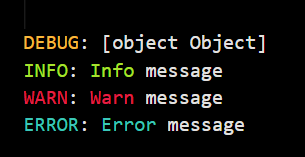

## Setting the log level

The log level and is set as an environment variable called `LOG_LEVEL`.

<!-- prettier-ignore-start -->
!!! note
    The log level **is NOT** case sensitive.
<!-- prettier-ignore-end -->

<!-- prettier-ignore-start -->
??? example
    You can set the log level in a `.env` file and the logger will pick it up thanks to the `dotenv` package:

    ```bash
    # .env
    LOG_LEVEL = warn
    ```
<!-- prettier-ignore-end -->

### Log levels:

| Log Level |   Method   |                                       Description                                        |                  Printed                   |
| :-------: | :--------: | :--------------------------------------------------------------------------------------: | :----------------------------------------: |
|  `error`  | `logError` |                Used to log problems that require code execution to stop.                 |                   Always                   |
|  `warn`   | `logWarn`  |             Used to log problems that do not require code execution to stop.             | `LOG_LEVEL` in `["warn", "debug", "info"]` |
|  `info`   | `logInfo`  | Used to print generic informational messages. Informs the user on the actions performed. |     `LOG_LEVEL` in `["debug", "info"]`     |
|  `debug`  | `logVars`  |  Used to print variables to the console. Mainly intended for development and debugging.  |         `LOG_LEVEL` in `["info"]`          |

## Adding a timestamp before each log message

By defining the `TIMESTAMP` environment variable, the logger will automatically log the messages in the `[{timestamp}] {message}` fomrmat.

<!-- prettier-ignore-start -->
!!! note
    The timestamp is NOT\*\* case sensitive.
<!-- prettier-ignore-end -->

<!-- prettier-ignore-start -->
??? example
    You can set the timestamp in a `.env` file and the logger will pick it up thanks to the `dotenv` package:

    ```bash
    # .env
    TIMESTAMP = date
    ```
<!-- prettier-ignore-end -->

### Timestamp options

- `TIMESTAMP = millis`

Will prefix the message with the current number of milliseconds from epoch.



- `TIMESTAMP = date`

Will prefix the message with the current date in the `YYYY-MM-DD HH:MM:SS:mmm`.



- No timestamp

If the `TIMESTAMP` variable is not set, then the logger will simply not prefix the messages with anything. This also happens if the value is not one of the 2 mentioned above.



## Logging to the console

The logger class will print all your messages to the console by default.

## Logging to a file

The logger will automatically log everything to a text file as well as to the console, as long as the `LOG_FILE` environment variable is defined.

```bash
# .env
LOG_FILE = /var/log/pyle-of-mail.log
```

## Logging to a syslog server

<!-- prettier-ignore-start -->
!!! warning
    Not yet supported, planned for release `1.3.0`.
<!-- prettier-ignore-end -->
